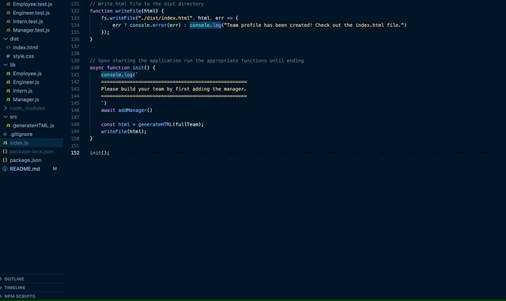

# 👩‍💻 Team Profile Generator

This tool will help users generate an HTML page to display summaries for each person on their team.

## Table of Contents
  * [Technologies](#technologies)
  * [Functionality](#functionality)
  * [Challenges](#challenges)
  * [Future Development](#future-development)
  * [Contact](#contact)
  * [License](#license)

## Technologies
* HTML
* CSS
* Bootstrap
* JavaScript
* Node.js
* Inquirer npm package
* Jest testing suite
* Object Oriented Programming

## Functionality
[App Demonstration Video](https://youtu.be/9G_QRztzwVc)

#### App Initialization
- Be sure to first run <code>npm i</code> after cloning this repo or copying its code into your own files.
- Once the appropriate node modules have been installed, run <code>node index.js</code> to initialize the app:

## Challenges
* It was difficult to organize the logic in order to be sure that after the user entered the manager's information, they could have the option to add another employee or not. Then after that, I needed to be sure they would be asked again after each new employee was added. It ended up not being so complicated, but coming to the final solution took some tinkering.
* At first, writing the tests was a bit of a challenge, but once I became more comfortable with the syntax and general approach, it was relatively easy.

## Future Development
In the future, I would like to add validation to be sure that what the user enters is a valid type of information for the given question (for example, being sure an email address is written in an appropriate format, or simply that the user entered something at all).

## Contact
Email me any time with questions, comments, or cat/dog photos! - ctbarrett.tech@gmail.com

## License
&copy; 2021 Charles Tucker Barrett

[MIT License](https://opensource.org/licenses/MIT)